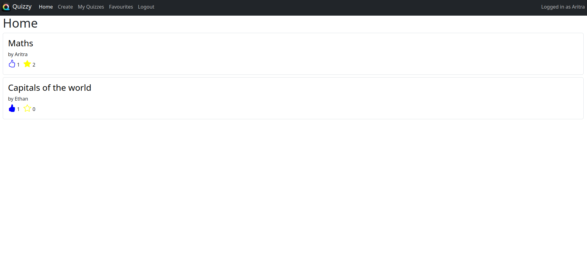
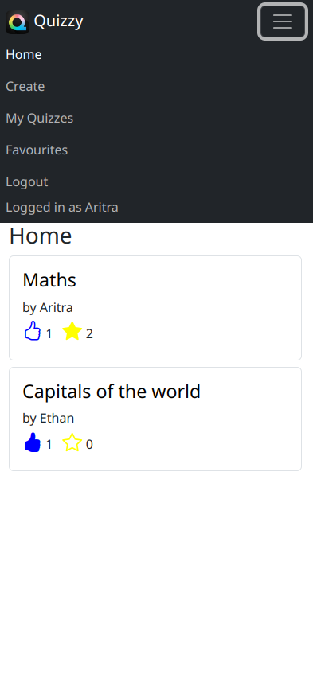

# Quizzy

#### This is my entry for the final project (capstone) of the CS50W course 💻. 

#### !! Not continuing work on this project (for now) !!

#### Quizzy is a web application that allows you and your friends to make and use interactive quizzes. Have fun goofing around or studying! ✨

---
<br>

## Installation

You must have [python](https://www.python.org/) installed to run this application.

Firstly, clone the repository (alternatively you can download and extract the repo):

```
git clone https://github.com/aritra-codes/quizzy.git
```

Then, change directories into the newly cloned repository:

```
cd quizzy
```

Then, using [pip](https://pip.pypa.io/en/stable/), install the application dependencies:

```
pip3 install -r requirements.txt
```

To run the application, you first need to apply the migrations:

```
python3 manage.py migrate
```

---
<br>

## Usage

Run the server:

```
python3 manage.py runserver
```

---
<br>

# Distinctiveness and Complexity

This project was inspired by the website Quizizz, a quiz website. This idea is completely different from other projects in the CS50W course. The basic idea of my website to provide users with a way to easily access and create quizzes. It can be used in many ways, such as a leisure activity or a serious tool to study. I made this website because I wanted to test out my web development skills and see if I can make more complex websites.

I started working on this project by making the create quiz form, which allows users to create their very own quizzes. After finishing this, I worked on the home page which displays all the quizzes in the database which have their visibility set to public. At the same, I also worked on the stylish navbar, and the login and register pages. This allowed me start working on the page that displays the quiz itself and gives feedback to the user depending on the answers they put in. When the user presses the submit button in this page, it seamlessly grades the questions and shows the user which questions they have gotten right and which they have gotten wrong. I finally finished off my making the my quizzes and favourites page, which are self-explanatory.

My website utilises several Django models to keep track of different quizzes, questions and users. It also uses Javascript to allow for the seamless usage of like and favourite buttons. The Javascript also plays a crucial role in submitting the forms that allow the users to create their own quizzes.

My website is also mobile responsive due to the usage of Bootstrap, an amazing CSS/JS library. This has allowed me to introduce responsiveness to all the HTML elements such as the navbar and create quiz form. As a result of the usage of Bootstrap, elements in my website also size and position in a way that they adjust to the width and height of the user's screen.

<figure>
    
    <figcaption>Quizzy on a desktop</figcaption>
</figure>

<figure>
    
    <figcaption>Quizzy on a mobile device</figcaption>
</figure>

---
<br>

# File structure description

```
.
├── capstone -> core application
│   ├── asgi.py -> asgi  configuration
│   ├── settings.py -> project settings
│   ├── urls.py -> global urls mapping
│   └── wsgi.py -> wsgi configuration
├── quizzy -> main application that contains the website
│   ├── migrations
│   │   ├── 0001_initial.py -> initial database migration
│   ├── static
│   │   └── quizzy
│   │       ├── create-quiz.js ->
│   │       ├── interactive-buttons.js -> functionality for like and favourite buttons
│   │       ├── navbar.js -> selecting a navbar link depending on the pathname
│   │       ├── quiz.js -> functionality for submitting and getting feedback from a quiz
│   │       ├── quizzy-logo.png -> quizzy logo image
│   │       └── quizzy-screenshot.png -> quizzy desktop screenshot image
│   │       ├── quizzy-screenshot-mobile.png -> quizzy mobile screenshot image
│   ├── templates
│   │   └── quizzy
│   │       ├── index.html -> index/home page
│   │       ├── layout.html -> page layout for all other pages
│   │       ├── quizzes-layout.html -> page layout for quiz listing pages
│   │       ├── quiz.html -> page layout for a quiz
│   │       ├── favourites.html -> favourite quizzes page
│   │       ├── my-quizzes.html -> my quizzes page
│   │       ├── create-quiz.html -> create quiz page
│   │       ├── error-403.html -> error 403 page
│   │       ├── error-404.html -> error 404 page
│   │       ├── login.html -> login page
│   │       └── register.html -> register page
│   ├── admin.py -> admin page configuration
│   ├── apps.py -> apps configuration
│   ├── models.py -> app models
│   ├── urls.py -> website urls mapping
│   └── views.py -> website views and api endpoints
├── manage.py -> core app commands
├── README.md -> instructions
└── requirements.txt -> project dependencies

10 directories, 49 files
```

---
